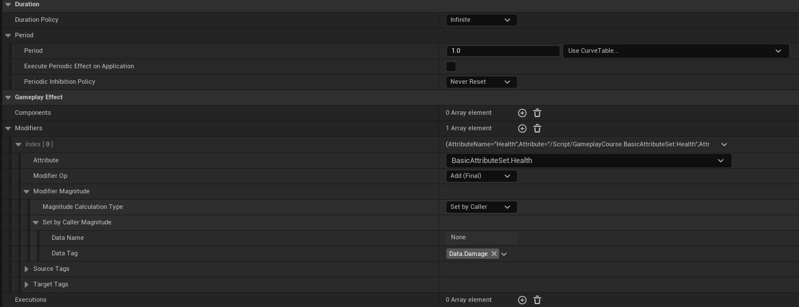
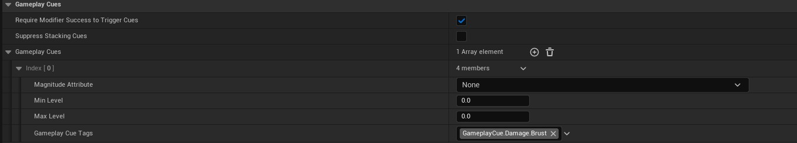
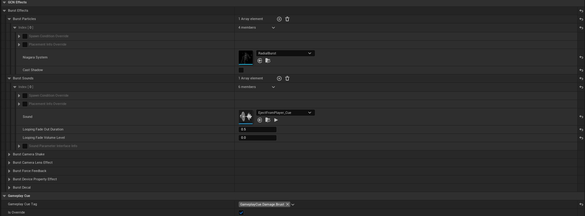
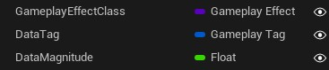
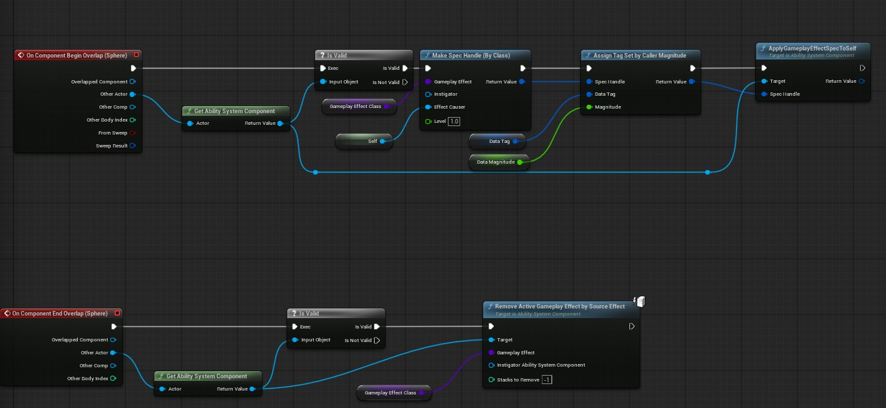

# Area Ability
In this ability example we are going to create a base actor class that has a sphere trigger which applies an effect on our player when they overlap it.

## Check List
Make sure that you already have:
- Attribute set with health attribute in it.
- Ability system component attached to your player character.
- Attributes are clamped in pre-attribute change and post effect.

## Create Infinite Damage Effect
Create a new gameplay effect class and name it `GEDamageOverTimeInfinite` this will be an infinite effect, meaning as long as it is applied onto player it will keep dealing damage.

These are the settings we have:

Notice the following things:
- Duration policy is infinite.
- Period is 1.0 second, while execute periodic effect on application is set to false, this means on applying this effect it will wait the period before applying the first effect.
- Modify the attribute of type health, add final and set the magnitude by caller, this means the caller will provide the damage value.
- Make sure to add Data tag of `Damage` type.

For our gameplay cue, just tag it for damage brust.

## Cue
This is how our brust cue is setup, notice this is a brust cue which gives us automatic fields for things such as particles, sounds and camera shakes.

This is inherited from `GCN Brust`

## Creating Area Actor
We first create an area base actor with these public values which will allow us to change the type of gameplay effect we apply on overlap start or end.

- Effect will be damage infinite.
- Tag will be our `Data.Damage`.
- Magnitude is `-15`.

The overlap logic is simple:

- Check if overlapping actor has `ASC`.
- Make a spec handle as we need to pass some custom data and tag.
- assign effect class and tag.
- Apply.

If the data tag in your gameplay effect matches the data tag you sent via spec handle it will apply the magnitude.

That is it, if everything is correct you will take damage after 1 second of you being in the area trigger.

In the next lesson, we will use `wait for attribute change` node to link our stamina value to widget.