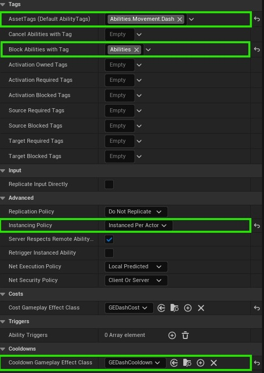
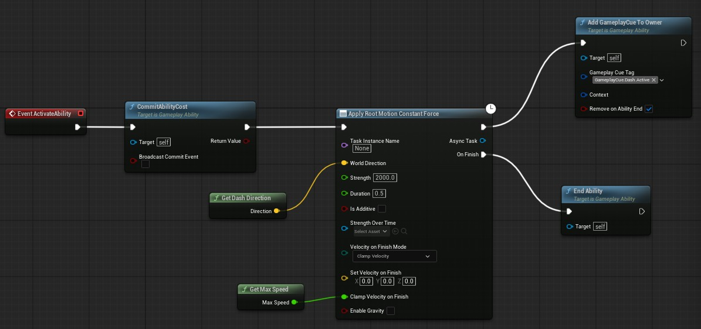
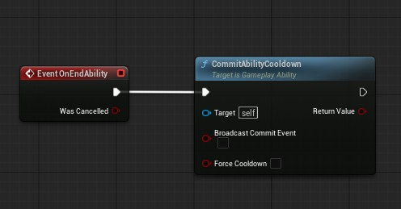
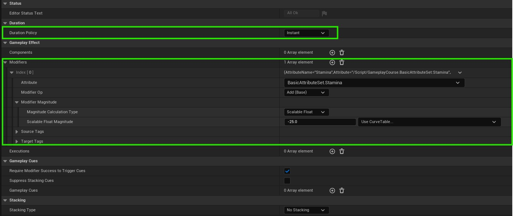
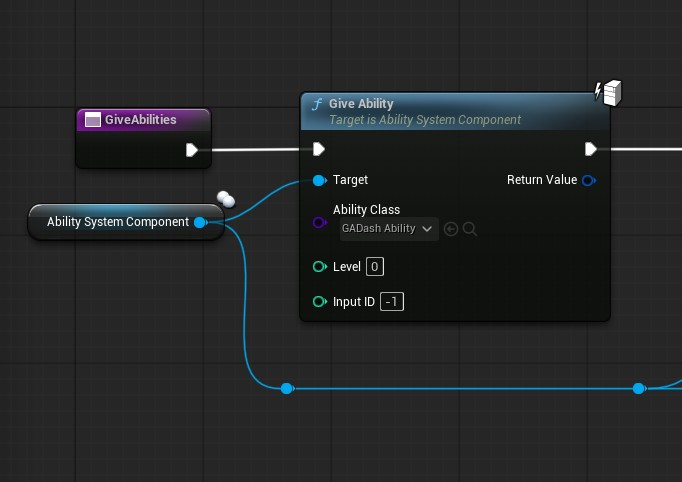
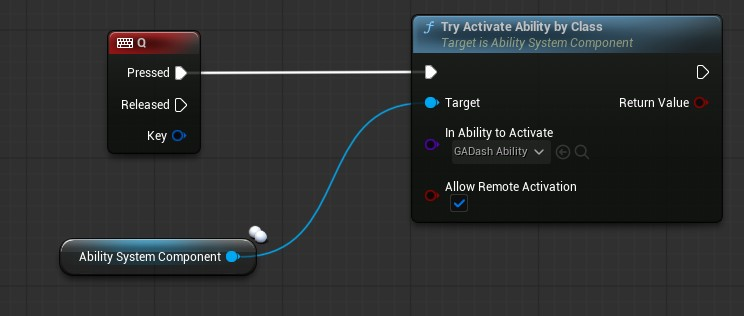

# Dash Ability
We will now dwell into abilities, for this section we don't need any C++ as we are currently not using any attributes.

- Create a blueprint that derived from class `Gameplay Ability`
- Add event called `Event Activate Ability` and `Event End Ability`

### Assigning Tags
Each ability can be assigned asset tags these are the tags that are automatically applied to the user during the duration of ability being active.

For the Dash ability I setup the details like this:
<p align="center">

</p>

- Ability asset tag is `Abilities.Movement.Dash`
- Block tag is `Abilities` that means while we are dashing we cannot activate any other ability that falls under the ability tag.
- Instancing policy is instance per actor, this is useful if we want to maintain a state, for example how many times player clicked left mouse button we increment the counter each time.
- Cool down is a effect class which we will discuss in a moment.

### Dash Ability Code
<p align="center">

</p>

A few things going on here, first of all when dealing with abilities prefer to use tasks, there are a few gameplay tasks that unreal engine provides by default one of them is `Apply Root Motion Constant Force` this is what we are using for our Dash, it moves the root component of our character in a provided direction with some strength.

- `Commit Ability Cost` is one of the functions that is needed deduct some attribute value, which in our case will be the stamina, which we will add in our C++ in a bit.
- Just as we apply the root motion we need to somehow tell our ability system to play some VFX or SFX this can be done using `Cues`, cues are triggered using tags so in our case we added gameplay cue tag to owner `GameplayCue.Dash.Active`.
- On Finish we will call end ability which will call another event.

<p align="center">

</p>

>Remember for gameplay cue tags, they all should live under the `GameplayCue` parent tag.

You can also just use `Commit Ability` node which is call both cool down and cost at the same time.

### Adding Cost
Before we add cost we need to add attributes to our player, so we can add a health and stamina attribute and we have cost which drains our stamina when dash is used.

For that we will need C++, create a new C++ class derived from `UAttributeSet`.

These are the includes you need:
```cpp
#include "AttributeSet.h"
#include "AbilitySystemComponent.h"
```

Right under the constructor in your header file add these members:
```cpp
UPROPERTY(BlueprintReadOnly, Category = "Attributes", ReplicatedUsing = OnRep_Health)
FGameplayAttributeData Health;
ATTRIBUTE_ACCESSORS_BASIC(UBasicAttributeSet, Health);

UPROPERTY(BlueprintReadOnly, Category = "Attributes", ReplicatedUsing = OnRep_MaxHealth)
FGameplayAttributeData MaxHealth;
ATTRIBUTE_ACCESSORS_BASIC(UBasicAttributeSet, MaxHealth);
	
UPROPERTY(BlueprintReadOnly, Category = "Attributes", ReplicatedUsing = OnRep_Stamina)
FGameplayAttributeData Stamina;
ATTRIBUTE_ACCESSORS_BASIC(UBasicAttributeSet, Stamina);

UPROPERTY(BlueprintReadOnly, Category = "Attributes", ReplicatedUsing = OnRep_MaxStamina)
FGameplayAttributeData MaxStamina;
ATTRIBUTE_ACCESSORS_BASIC(UBasicAttributeSet, MaxStamina);
```

`ATTRIBUTE_ACCESSORS_BASIC` is a new macro that automatically generates getters and setters for each of your attribute members.

Also add the related `OnRep` functions:
```cpp
UFUNCTION()
void OnRep_Health(const FGameplayAttributeData& OldValue) const
{
	GAMEPLAYATTRIBUTE_REPNOTIFY(UBasicAttributeSet, Health, OldValue);
}

UFUNCTION()
void OnRep_MaxHealth(const FGameplayAttributeData& OldValue) const
{
	GAMEPLAYATTRIBUTE_REPNOTIFY(UBasicAttributeSet, MaxHealth, OldValue);
}

UFUNCTION()
void OnRep_Stamina(const FGameplayAttributeData& OldValue) const
{
	GAMEPLAYATTRIBUTE_REPNOTIFY(UBasicAttributeSet, Stamina, OldValue);
}

UFUNCTION()
void OnRep_MaxStamina(const FGameplayAttributeData& OldValue) const
{
	GAMEPLAYATTRIBUTE_REPNOTIFY(UBasicAttributeSet, MaxStamina, OldValue);
}
```
And lastly add `GetLifetimeReplicatedProps`, `PreAttributeChange` and `PostGameplayEffectExecute` as well.
```cpp
virtual void GetLifetimeReplicatedProps(TArray<class FLifetimeProperty>& OutLifetimeProps) const override;

virtual void PreAttributeChange(const FGameplayAttribute& Attribute, float& NewValue) override;

virtual void PostGameplayEffectExecute(const struct FGameplayEffectModCallbackData& Data) override;
```

In your source file add these two new headers:
```cpp
#include "Net/UnrealNetwork.h"
#include "GameplayEffectExtension.h"
```

and implement the functions you just declared:
```cpp
UBasicAttributeSet::UBasicAttributeSet()
{
	Health = 100.0f;
	MaxHealth = 100.0f;
	Stamina = 100.0f;
	MaxStamina = 100.0f;
	Damage = 25.0f;
	Heal = 25.0f;
}

void UBasicAttributeSet::GetLifetimeReplicatedProps(TArray<class FLifetimeProperty>& OutLifetimeProps) const
{
	Super::GetLifetimeReplicatedProps(OutLifetimeProps);

	DOREPLIFETIME_CONDITION_NOTIFY(UBasicAttributeSet, Health, COND_None, REPNOTIFY_Always);
	DOREPLIFETIME_CONDITION_NOTIFY(UBasicAttributeSet, MaxHealth, COND_None, REPNOTIFY_Always);
	DOREPLIFETIME_CONDITION_NOTIFY(UBasicAttributeSet, Stamina, COND_None, REPNOTIFY_Always);
	DOREPLIFETIME_CONDITION_NOTIFY(UBasicAttributeSet, MaxStamina, COND_None, REPNOTIFY_Always);
}

void UBasicAttributeSet::PreAttributeChange(const FGameplayAttribute& Attribute, float& NewValue)
{
	Super::PreAttributeChange(Attribute, NewValue);

	if (Attribute == GetHealthAttribute())
	{
		Health = FMath::Clamp<float>(NewValue, 0.0f, GetMaxHealth());
	}
	else if (Attribute == GetStaminaAttribute())
	{
		Stamina = FMath::Clamp<float>(NewValue, 0.0f, GetMaxStamina());
	}
}

void UBasicAttributeSet::PostGameplayEffectExecute(const struct FGameplayEffectModCallbackData& Data)
{
	Super::PostGameplayEffectExecute(Data);

	if (Data.EvaluatedData.Attribute == GetHealthAttribute())
	{
		SetHealth(GetHealth());
	}
	else if (Data.EvaluatedData.Attribute == GetStaminaAttribute())
	{
		SetStamina(GetStamina());
	}
}
```

So, what is post and pre-attribute change? these are just call-backs when your attribute values get modified so naturally this is a perfect place to clamp the values.

The Reason for post gameplay effect is that if your attribute is changed via another effect the pre-attribue change won't fire unless you manually call the `Set` function with the current value.

Now, go back to your character class and add this attribute set and construct it in your default constructor.
```cpp
UPROPERTY(VisibleAnywhere, BlueprintReadOnly, Category = "Ability System")
UBasicAttributeSet* BasicAttributeSet;
```

```cpp
BasicAttributeSet = CreateDefaultSubobject<UBasicAttributeSet>(TEXT("BasicAttributeSet"));
```

That is it, now you can go into your editor and press `'` OR `Shift + '` key to check your character have 2 attributes called stamina and health.

### Dash Cost Gameplay Effect
Create a new blueprint derived from `Gameplay Effect`, in it we will add a negitive value to our stamia attribute.
<p align="center">

</p>

- Instance policy will be instance, as cost deducts instantly.
- Add a negitive value to your stamina attribute.

That is it, now since this effect is referenced in your dash ability in the cool down slot as soon as that ability fires the `Commit Cooldown` function this will deduct value form your stamina.

### Giving Abilities to Character
Now all that is left is to give this ability to your player and activate it on a button press.

I have a function that runs on begin play and gives abilities to player.
<p align="center">

</p>

And on `Q` button I try to activate the dash ability by class.
<p align="center">

</p>

That is it for dashing, next we will move onto creating a trigger area that damages our player and another area that heals our players.