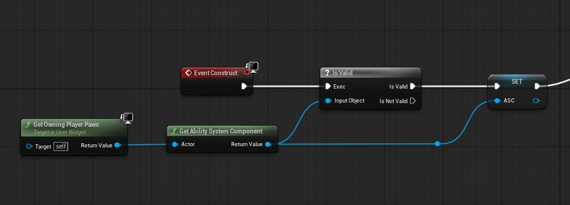
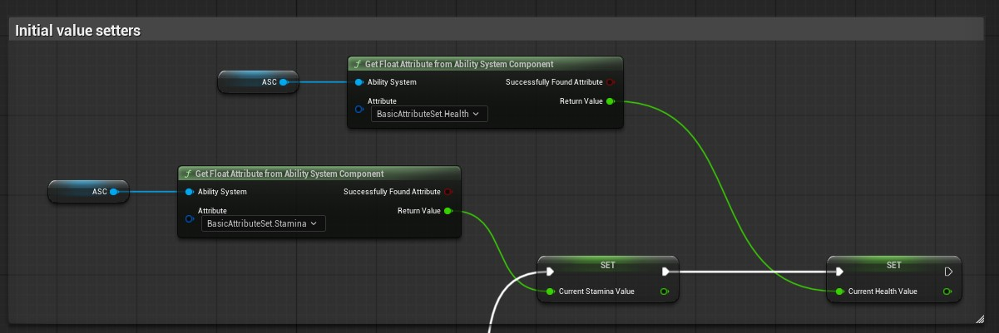
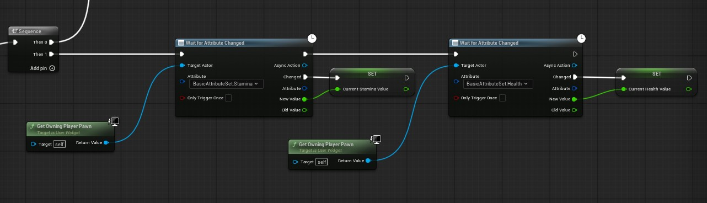
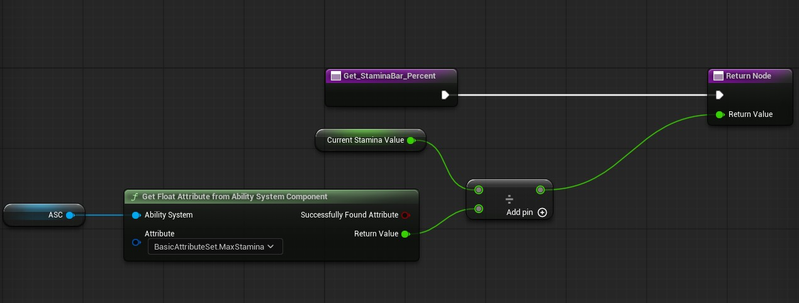
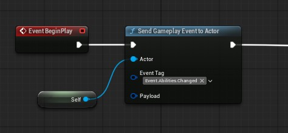
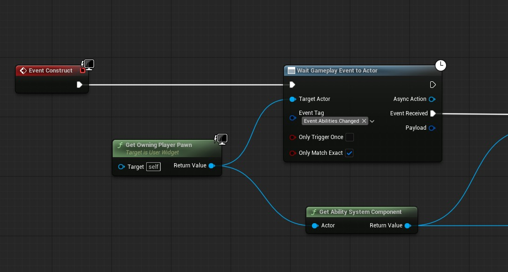

## Hooking Up Stamina And Health Widgets
In this section we will see what kind of wait for attribute change events we can utilize in order to communicate from our player to widget.

# Creating HUD
HUD will contain canvas and other widgets that include our health and stamina bar, after containing a HUD widget and adding canvas panel, create another user widget and call it `WBPHealthStamina`.

Inside the health and stamina widget add two progress bars wrapped in a vertical box. Add this widget to your HUD widget.

Now, inside the health and stamina widget you will need to create 2 variables that will keep track of current health and stamina values, we will also get the current health and stamnia attribute from our ASC and set them initially.

First of all cache the Ability system component from owning pawn.

Now Set the initial values, use the `Get Float Attribute from Ability System Component` node.

Lastly use 2 `wait on attribute changed` nodes to update the variables.

Now select your progress bar and create a binding function so it automatically gets the current value and normalizes it and updates the bar.

Do the same with health as well and you are done, now your widget will update accordingly.

## On Abilities Changed Event
Lets say you have an abilities bar which creates widgets based on the number of abilities you have granted your character.

For that you will need to send a gameplay event from your player after you have granted abilities and receive it in your widget and then call `get all abilities` node to get an array of abilties.

And inside Widget:

Now this becomes a bit tricky with multiplayer so you need to do this correctly on both server and on client using `OnRepNotify` function.